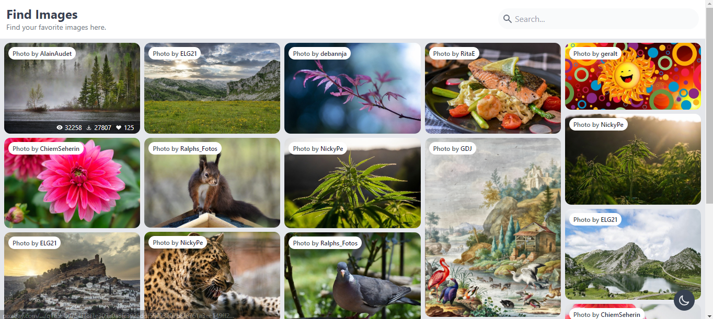

# Find Images

A simple image gallery website, to find your favorite images here.

## Run this app

1. Clone this repository  
   `git clone https://github.com/rickyroynardson/find-images.git` or `gh repo clone rickyroynardson/find-images`
2. Install dependencies  
   `npm install`
3. Copy environment `.env.example` to `.env` and fill with your own [Pixabay API](https://pixabay.com/api/docs) Key
4. Run  
   `npm start`
